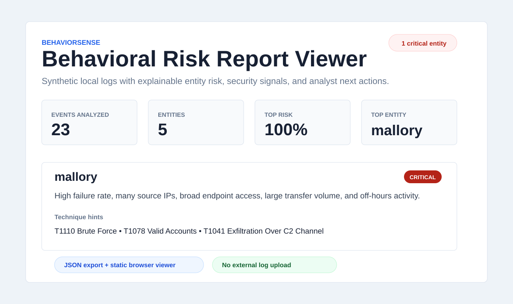

# Project Evidence

This page records reproducible evidence for BehaviorSense. The bundled sample
dataset is synthetic and designed to demonstrate behavioral anomaly triage
without using real user activity logs.

## Evidence Snapshot



## Technical Evidence

Snapshot verified on July 29, 2026:

- Local behavioral profiling for users and IP-backed entities.
- Population deviation scoring with explicit security-signal boosts.
- MITRE ATT&CK-style technique hints and recommended analyst actions.
- JSON export for SIEM, SOAR, handoff, and browser review.
- Static TypeScript report viewer in `web/` for reviewer-friendly analysis.
- Python standard-library runtime for the detector.
- Unit tests covering parser, scoring, CLI export, and sample ranking behavior.

## Reproducible Demo

```bash
python3 detector.py sample_data/ --verbose
python3 detector.py sample_data/ --output web/sample-report.json
```

Expected sample summary:

| Metric | Value |
| --- | ---: |
| Events analyzed | 23 |
| Entities profiled | 5 |
| Critical entities | 1 |
| Top entity | mallory |

The sample intentionally returns exit code `2` because the detector found a
critical-risk entity. For this project, that exit code means the security
finding path worked.

## Browser Viewer

```bash
cd web
python3 -m http.server 8080
```

Open `http://127.0.0.1:8080/` and load the bundled sample report. The viewer
shows ranked entities, scores, contributing signals, technique hints, and
recommended actions.

## Evidence Boundaries

BehaviorSense is a local triage engine, not a user behavior analytics platform.
It does not ingest identity context, asset criticality, business role, or
historical baselines across long time windows yet. Its value is fast,
explainable anomaly review over local evidence.
